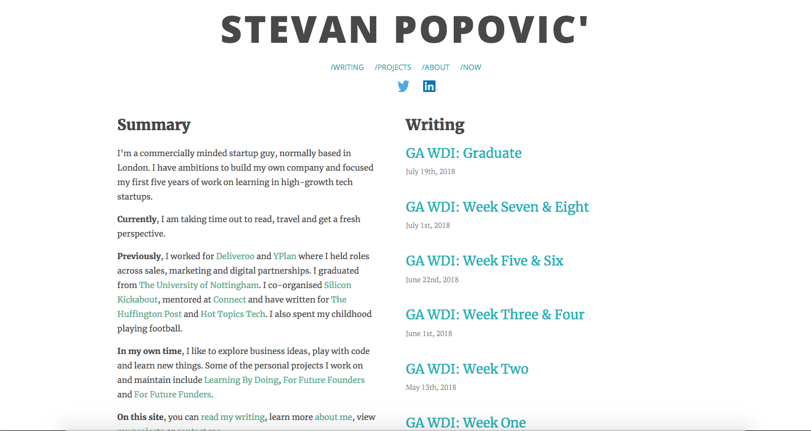
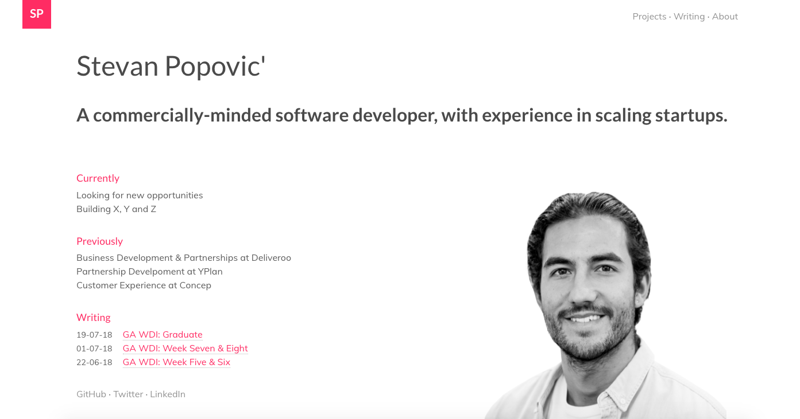
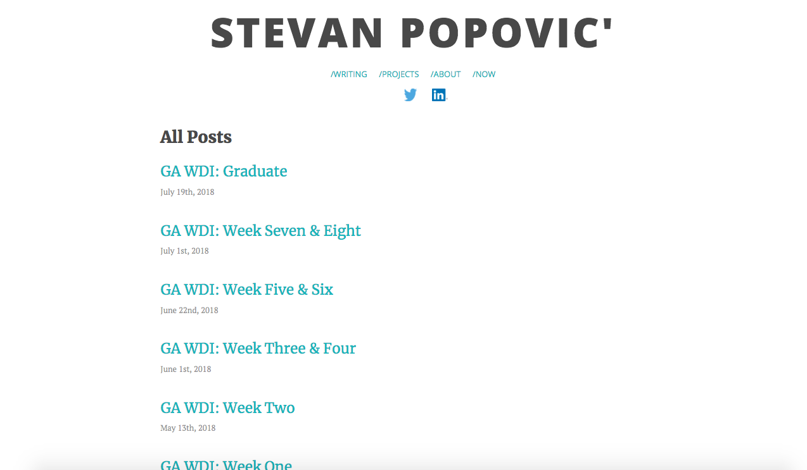
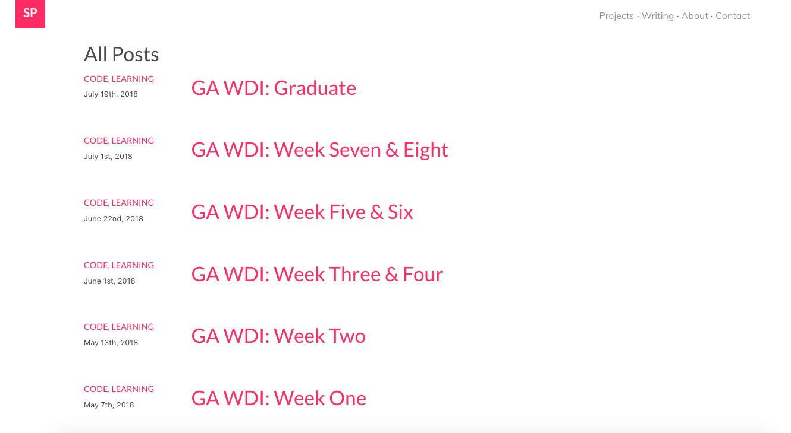
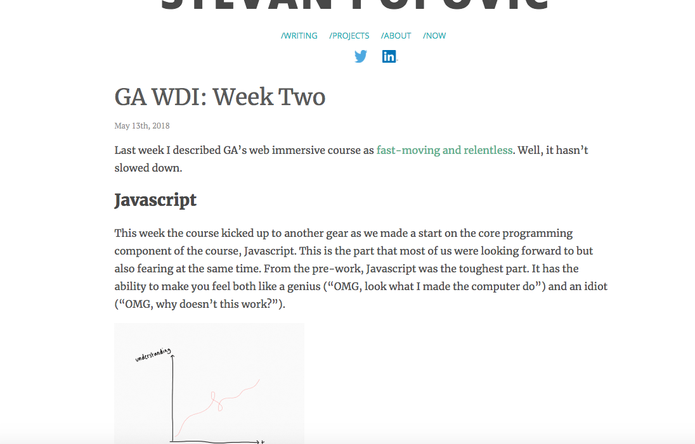
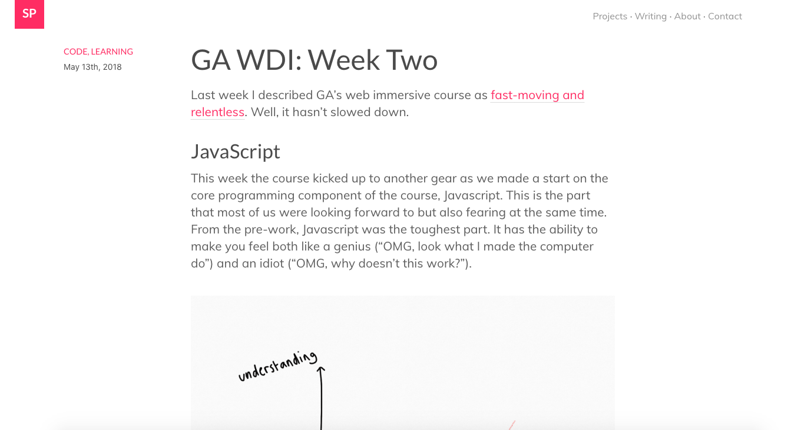
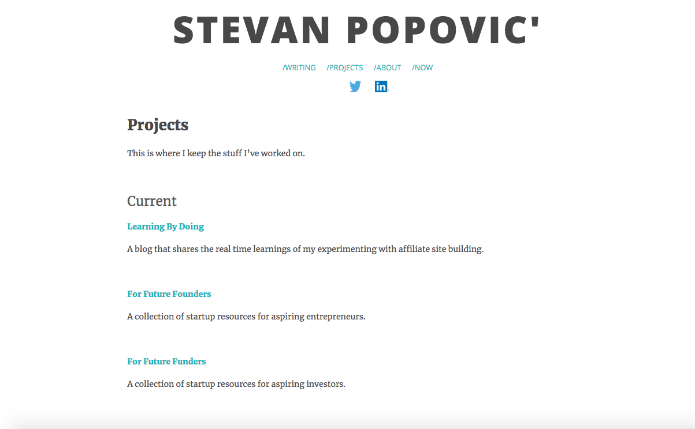
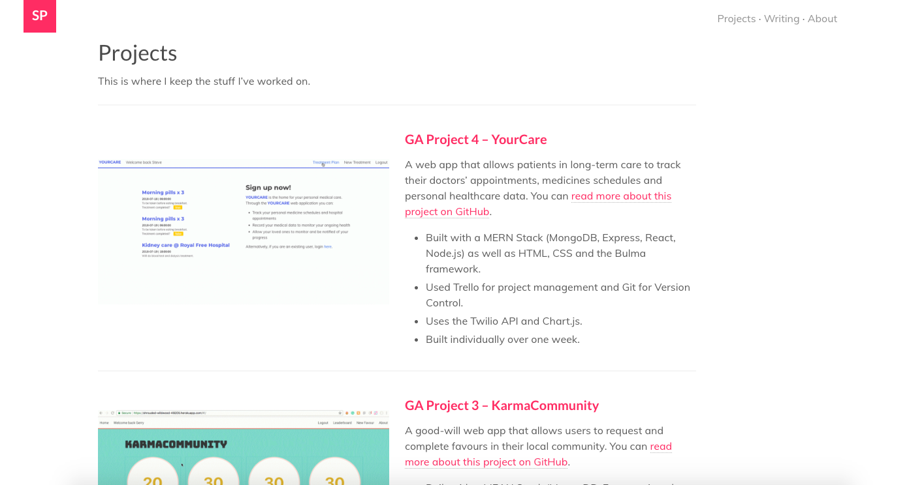
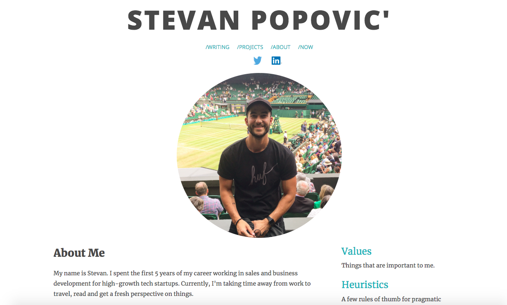
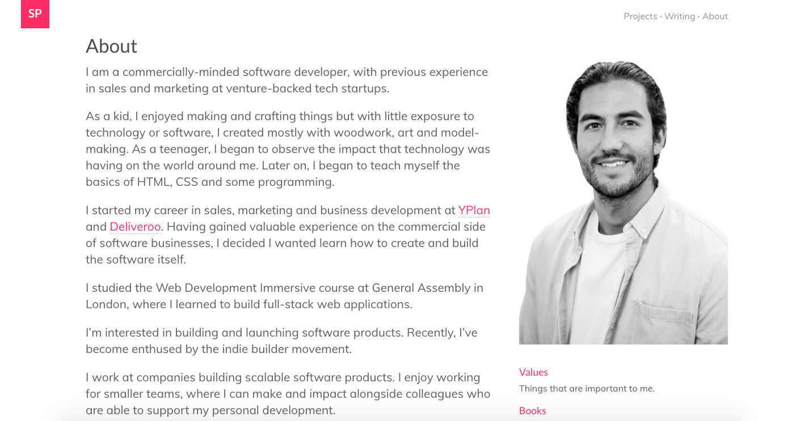

# Personal Website Custom Theme

I created a custom theme for my personal website. I have had the website, running on a Wordpress, for many years. It has a huge number of posts and content that I didn't want to lose or migrate, so I chose to develop a unique Wordpress theme from scratch. This allowed me to create a project were the focus was on the front-end (HTML & CSS, Bulma framework, design) and dabble in a new back-end language (PHP).

##### [Visit my website](http://www.stevanpopovic.com/) to check it out.

## Major Changes for V2
1. **Style** - An update in fonts and colour scheme.
2. **Mobile** - Made improvements for smaller devices.
3. **Home Page** - I wanted the home page to be a snapshot of me. The aim was to be clear and concise, highlighting what I'm working on now (currently), what I've worked on in the past (previously) and my most recent thoughts (writing). It also has links to my various other parts, including an email list.
4. **Writing Page** - This is an important part of my personal site. Whilst I don't take my writing too seriously, I enjoy the process immensely and I feel people learn a lot about me and my thinking through my writing. I wanted this page to just have slightly more information available to the user (tags, dates).
5. **Post Page** - Changed the styling on the single post page and added meta data along the left hand side.
6. **Projects Page** - This page is more important following my career change. This acts as a portfolio of my previous work.
7. **About Page** - Not much changed here apart from content.
8. **Contact Page** - Felt it was important to add more of a contact page so people know the best ways to reach me, especially as I'm keen to grow my technical circle following the career change.

## Gallery

### Home Page - Before

### Home Page - After

### Writing Page - Before

### Writing Page - After

### Post Page - Before

### Post Page - After

### Projects Page - Before

### Projects Page - After

### About Page - Before

### About Page - After

## Contact Me
Feel free to ask me questions about this project or anything else [on twitter](https://twitter.com/StevanPopo).

You can also find me on [LinkedIn](https://www.linkedin.com/in/stevanpopovic/) or over on [my personal site](http://www.stevanpopovic.com/).
